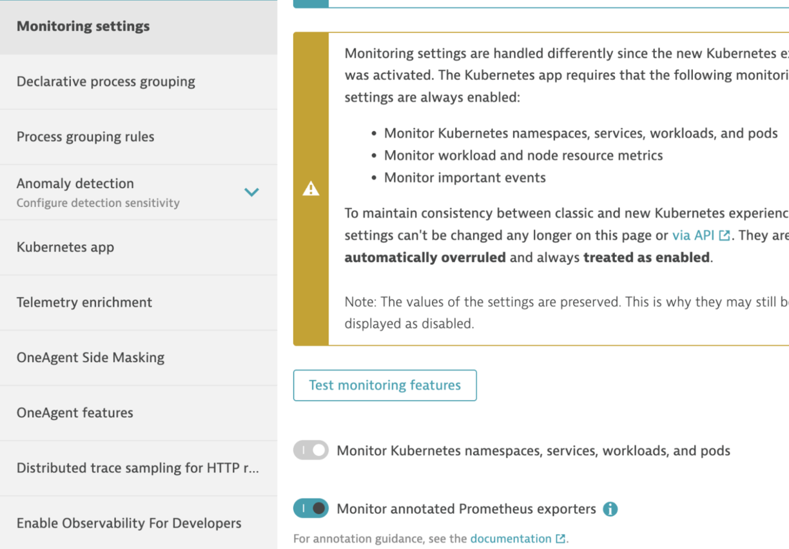
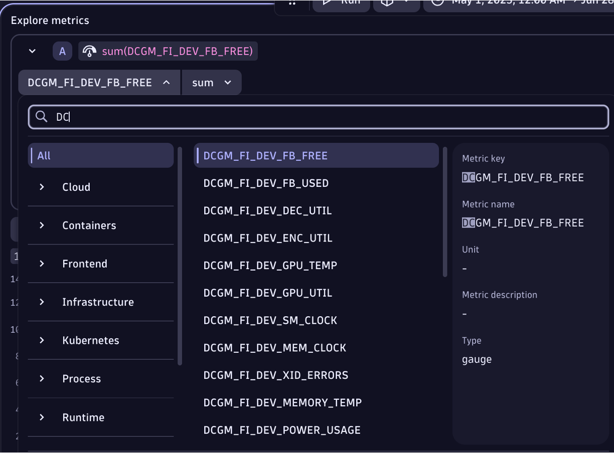
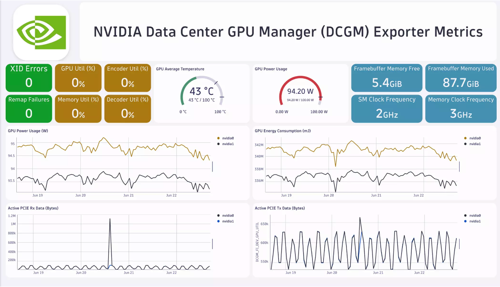

# What is the NVIDIA DCGM-Exporter

[DCGM-Exporter](https://docs.nvidia.com/datacenter/cloud-native/gpu-telemetry/latest/dcgm-exporter.html) is a tool based on the Go APIs to NVIDIA DCGM that allows users to gather GPU metrics and understand workload behavior or monitor GPUs in clusters. DCGM Exporter is written in Go and exposes GPU metrics at an HTTP endpoint (/metrics) for monitoring solutions such as Prometheus. For more details on the use cases see the [Dynatrace NVIDIA DCGM-Exporter Hub tile](https://www.dynatrace.com/hub/detail/nvidia-dcgm-exporter/?query=nvidi&filter=all)

Below is a guide for how to configure metrics scraping from the NVIDIA DCGM-Exporter for ingest and analysis within Dynatrace. 

## Metric ingest into Dynatrace 

There are a few options to ingest Prometheus metrics into Dynatrace such as [Scrape data from an OpenTelemetry Collector](https://docs.dynatrace.com/docs/ingest-from/opentelemetry/collector/use-cases/prometheus), but this guide is based on a configuration of the DCGM running within a K8s instance that is also running the [Dynatrace K8s solution](https://docs.dynatrace.com/docs/ingest-from/setup-on-k8s/deployment). Within the Dynatrace K8s solution, there is a Dynatrace Activegate which performs the actual metric scraping.

### Step 1

Within Dynatrace, complete the [Prerequisites](https://docs.dynatrace.com/docs/shortlink/monitor-prometheus-metrics#prerequisites) in your K8s  settings by enabling these settings as shown below:
* Monitor Kubernetes namespaces, services, workloads, and pods
* Monitor annotated Prometheus exporters



### Step 2

Run these commands to set the Dynatrace annotations as described [in the Dynatrace Documentation](https://docs.dynatrace.com/docs/observe/infrastructure-monitoring/container-platform-monitoring/kubernetes-monitoring/monitor-prometheus-metrics#annotate-prometheus-exporter-pods)

```
# verify pods present 
kubectl -n nvidia-gpu-operator get pods --selector=app=nvidia-dcgm-exporter 

# annotate pods
kubectl -n nvidia-gpu-operator annotate pods metrics.dynatrace.com/port=9400 --selector=app=nvidia-dcgm-exporter  
kubectl -n nvidia-gpu-operator annotate pods metrics.dynatrace.com/scrape=true --selector=app=nvidia-dcgm-exporter 

# verify
kubectl -n nvidia-gpu-operator describe pods --selector=nvidia-dcgm-exporter | grep dynatrace 
```

### Step 3

Validate and analyze metrics with notesbooks.  The metrics will have a `DCGM` prefix.  You can use notebook to as shown below.



### Step 4 

Review metrics in Dynatrace dashboard.



[An example Dashboard](https://dqr03366.apps.dynatrace.com/ui/apps/dynatrace.dashboards/dashboard/af667587-3d7f-4a66-899b-64869a3ce264#from=now%28%29-24h&to=now%28%29&tileIds=13) can be found in the Dynatrace Playground


## Reference to the metrics exposed by NVIDIA DCGM exporter.   

Refer to dcgm-exporter repo for more details https://github.com/NVIDIA/dcgm-exporter  
