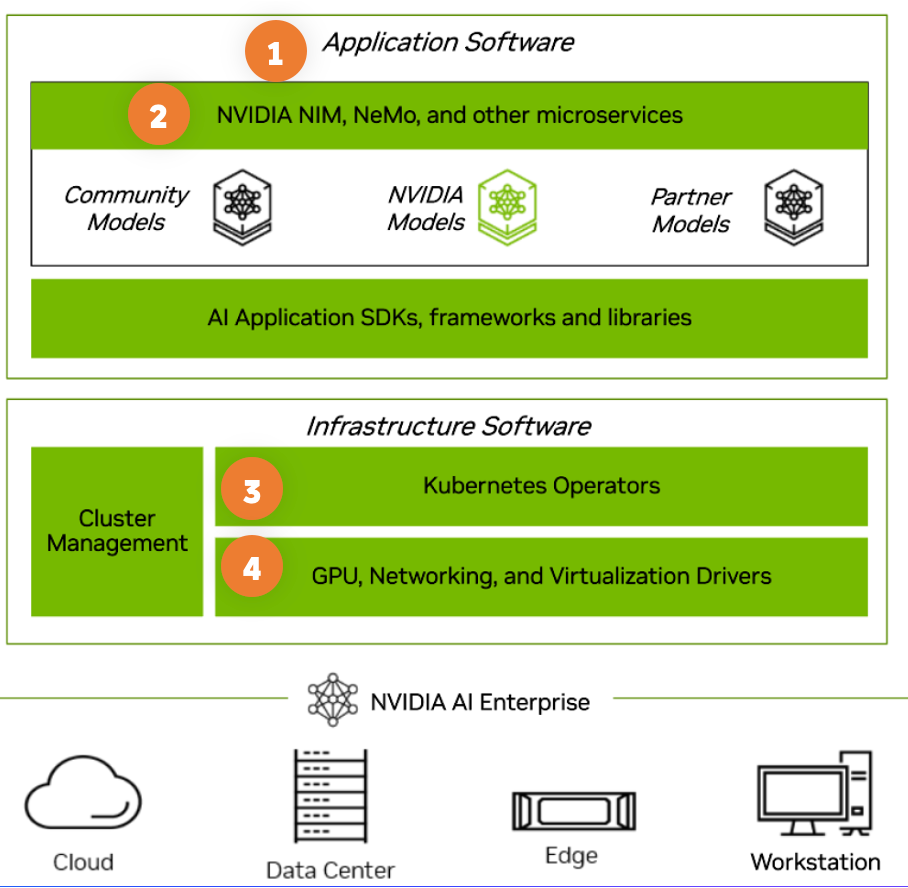

# Overview

This repo provides various guides to show how easy it is to setup and monitor the key tiers and components of the [NVIDIA enterprise stack](https://docs.nvidia.com/ai-enterprise), LLMs, and Generative AI applications with [Dynatrace](https://www.dynatrace.com).  

These guides are structured according the visual shown below.

## 1. AI Application Observability 

[Dynatrace AI Observability](https://www.dynatrace.com/hub/detail/ai-and-llm-observability/?filter=ai-ml-observability) brings End-to-End visibility to user interactions, prompt flows, and AI/LLM model performance of your Generative AI, agentic, and LLM services.

## 2. NVIDIA NIM, NeMo and technologies

Expanded observability coverage of exposed Prometheus metrics and OpenTelemetry telemetry from the various NVIDIA generative AI and lifecycle management tools and technologies. 

  * [NVIDIA NIM](NIM.md)

## 3. Kubernetes

Real-time auto-discovery and analysis of applications, NVIDIA platform components, and infrastructure.

## 4. GPU telemetry

Understand workload behavior or monitor GPUs in clusters

  * [DCGM-Exporter](DCGM-exporter.md)